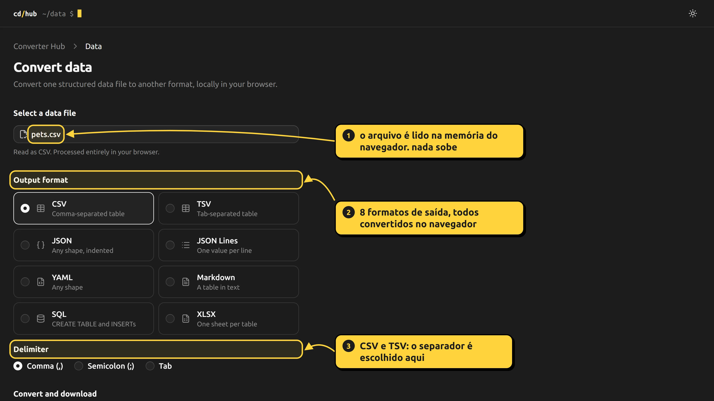

# prints que explicam: como gerei as capturas anotadas do portfólio

## tl;dr

os estudos de caso do meu portfólio têm prints com **rótulos numerados, setas e contornos** apontando pra o que importa. eu não desenho isso em editor de imagem: um script em Playwright abre o app **de verdade** no Edge, injeta um overlay (SVG + divs) por cima da página e tira a captura com `deviceScaleFactor: 3`, o que dá uma imagem 3840x2160. os prints antigos estavam borrados porque eu espremia uma página de 1280px numa coluna de 608px. a correção não foi só mais pixels: foi capturar com mais densidade, mostrar a mídia mais larga e deixar clicar pra abrir no tamanho real.

## o problema

o print é um recurso de explicação. o leitor tem que ver "isso aqui faz aquilo" sem eu escrever um parágrafo. só que um print de tela cheia, sozinho, não aponta nada, e eu estava com dois problemas:

- **o print não explicava.** uma tela inteira, e o leitor não sabe pra onde olhar;
- **o print estava ilegível.** a captura tinha 2560 pixels de largura (densidade 2x) e eu mostrava ela numa coluna de texto de **608px**. uma página de 1280px de largura numa coluna de 608px vai a menos da metade do tamanho (608 / 1280 = 0,475): um texto de 16px vira uns 7,6px. o navegador reduz a imagem e o resultado é aquele texto minúsculo e borrado.

## o que eu fiz

### 1. um overlay injetado na página real

em vez de editar a imagem depois, eu desenho a anotação **na própria página**, antes de capturar. a vantagem é que a posição dos alvos vem do layout de verdade: o Playwright me dá o `boundingBox()` do elemento, então o contorno nunca fica torto.

primeiro, no lado do Node, eu descubro onde estão os alvos. `items` é uma lista com um seletor, o texto do rótulo e onde o rótulo vai ficar:

```js
const boxes = [];
for (const it of items) {
  // vários alvos viram um contorno só (a união das caixas)
  const bs = await Promise.all([it.sel, ...(it.also ?? [])].map((s) => s(p).boundingBox()));
  const x = Math.min(...bs.map((b) => b.x)), y = Math.min(...bs.map((b) => b.y));
  const box = {
    x, y,
    width: Math.max(...bs.map((b) => b.x + b.width)) - x,
    height: Math.max(...bs.map((b) => b.y + b.height)) - y,
  };
  boxes.push({ label: it.label, at: it.at, max: it.max, box });
}
```

depois, `page.evaluate` monta uma camada fixa por cima de tudo, com um SVG pros contornos e setas e divs pros rótulos:

```js
await p.evaluate((boxes) => {
  const NS = "http://www.w3.org/2000/svg";
  const layer = document.createElement("div");
  layer.style.cssText = "position:fixed;inset:0;z-index:2147483647;pointer-events:none";
  const svg = document.createElementNS(NS, "svg");
  svg.setAttribute("width", innerWidth); svg.setAttribute("height", innerHeight);
  svg.style.cssText = "position:absolute;inset:0;overflow:visible";
  // a ponta da seta é um marker, reaproveitado por todas as setas
  svg.innerHTML = '<defs><marker id="ah" viewBox="0 0 10 10" refX="8" refY="5" markerWidth="6" markerHeight="6" orient="auto-start-reverse"><path d="M0,0 L10,5 L0,10 z" fill="#ffd43b"/></marker></defs>';
  layer.append(svg); document.body.append(layer);
  // ...um loop por alvo, abaixo
}, boxes);
```

pra cada alvo, três peças:

**o contorno:** um `rect` com um respiro de 6px em volta do elemento, cantos arredondados e um fundo amarelo bem transparente.

**o rótulo:** uma div com o número num círculo e o texto, com `position:absolute` nas coordenadas que eu passei.

**a seta:** um `path` com **curva quadrática** (`Q`) saindo do rótulo até a borda do contorno, terminando no marker:

```js
const d = `M${sx},${sy} Q${(sx + tx) / 2},${Math.min(sy, ty) - 18} ${tx},${ty}`;
path.setAttribute("d", d);
path.setAttribute("marker-end", "url(#ah)");
```

o ponto de controle da curva fica 18px acima do ponto mais alto da reta. é só isso que dá o arco; sem ele a seta seria uma linha dura. a ponta de seta é o `marker-end` com `orient="auto-start-reverse"`, que gira a ponta sozinha conforme a direção do traço.

o rótulo e a seta têm cálculo de onde a seta sai do rótulo (topo, base ou lateral, conforme a posição relativa do alvo). não vou colar tudo, mas a ideia é: a seta sempre sai do lado do rótulo que está mais perto do alvo.

### 2. captura em 4K

o app roda local, o script abre ele no Edge e tira a foto:

```js
const browser = await chromium.launch({ channel: "msedge" });

const ctx = await browser.newContext({
  viewport: { width: 1280, height: 720 },
  deviceScaleFactor: 3,
  colorScheme: "dark",
});
```

viewport de 1280x720 com `deviceScaleFactor: 3` é uma captura de **3840x2160**. o layout continua sendo o de 1280px (a página não "sabe" que está em 4K), mas cada pixel CSS vira 3x3 pixels reais. texto e traço saem nítidos, e o overlay também, porque é desenhado na própria página.

a função `shot` junta tudo:

```js
async function shot(name, url, items, prep) {
  const [ctx, p] = await newPage(3);
  await p.goto(url, { waitUntil: "networkidle" });
  if (prep) await prep(p); // ex.: carregar um CSV antes
  await wait(p, 900);
  // o cursor piscando mudaria entre capturas
  await p.evaluate(() => document.querySelectorAll("[class*=animate-caret]").forEach((e) => (e.style.animation = "none")));
  await annotate(p, items);
  await p.screenshot({ path: join(out, `${name}.png`) });
  await ctx.close();
}
```

e cada print é uma chamada com os alvos descritos por seletor acessível (texto, role) em vez de coordenada solta:

```js
await shot("converter-hub-data", `${HUB}/data`, [
  { sel: text("pets.csv"), label: "o arquivo é lido na memória do navegador. nada sobe", at: [600, 222], max: 340 },
  { sel: text("Output format"), label: "8 formatos de saída, todos convertidos no navegador", at: [600, 360], max: 340 },
  { sel: text("Delimiter"), label: "CSV e TSV: o separador é escolhido aqui", at: [600, 600], max: 320 },
], async (p) => { await p.locator('input[type="file"]').first().setInputFiles(file("pets.csv")); await wait(p, 1200); });
```

o resultado dessa chamada é essa imagem (o original é 3840x2160; aqui ela aparece na largura do README):



o script salva PNG, e o arquivo que vai pro site é um WebP, bem menor (no caso desse exemplo, uns 145 KB).

### 3. mostrar o print do jeito certo

captura nítida não adianta se a coluna de texto estreita aperta ela de volta. então mexi em três coisas no portfólio.

**a mídia vaza da coluna.** o texto fica numa coluna de 608px, mas o print pode ser mais largo. uma classe utilitária do Tailwind centraliza a mídia e deixa ela crescer até 1024px, sem passar da largura da tela:

```css
/* Mídia que vaza da coluna de texto (608px) até 1024px, centrada, sem passar da tela. */
@utility wide {
  position: relative;
  left: 50%;
  width: min(calc(100vw - 2rem), 64rem);
  translate: -50% 0;
}
```

**o markdown do artigo vira `<figure class="wide">`.** o componente de markdown troca o `` por uma figura com a classe `wide`, dentro de um link pro arquivo original:

```tsx
img: ({ src, alt }) => {
  if (typeof src !== "string" || !localImage.test(src) || !existsSync(join(process.cwd(), "public", src))) return null;
  return (
    <figure className="wide">
      {/* O print é de uma tela inteira: clicar abre em tamanho real pra ler os detalhes. */}
      <a href={src} rel="noopener" target="_blank">
        <Image alt={alt ?? ""} className="block h-auto w-full" height={2160} quality={90}
          sizes="(min-width: 1056px) 1024px, 100vw" src={src} width={3840} />
      </a>
      {alt && <figcaption>{alt}</figcaption>}
    </figure>
  );
},
```

três detalhes ali:

- **`sizes`** diz pro `next/image` que a imagem aparece com 1024px em tela larga, então ele serve uma versão do tamanho certo, e não a de 3840px inteira pra todo mundo;
- **o link** em volta abre o arquivo original numa aba nova, pra quem quer ler o detalhe pequeno;
- **`localImage`** é uma regex (`/^\/projects\/[\w.-]+$/`) que só aceita imagem de `/projects/`. o markdown dos artigos é conteúdo meu, mas não custa nada não aceitar URL de fora, e se o arquivo não existir no build a imagem some em silêncio.

## o que eu aprendi

- **o print também é interface.** densidade de captura, largura de exibição e tamanho original são três decisões diferentes, e o borrão vem de errar qualquer uma delas.
- **anotar na página é melhor que anotar na imagem.** as posições vêm do layout (`boundingBox`), o texto é texto, e refazer o print depois de mudar o app é rodar o script de novo.
- **`deviceScaleFactor` é o botão de nitidez.** o layout não muda; só aumenta a densidade de pixels.
- **seletor por texto e role aguenta mudança melhor que coordenada fixa.** só os rótulos têm coordenada (`at`), que é decisão de design e não de layout.
- **o leitor precisa de uma saída.** mesmo com 1024px, uma tela de 4K tem mais detalhe do que cabe na página, então clicar abre no tamanho real.

o código do portfólio está em [di0rio](https://github.com/di0rio).
