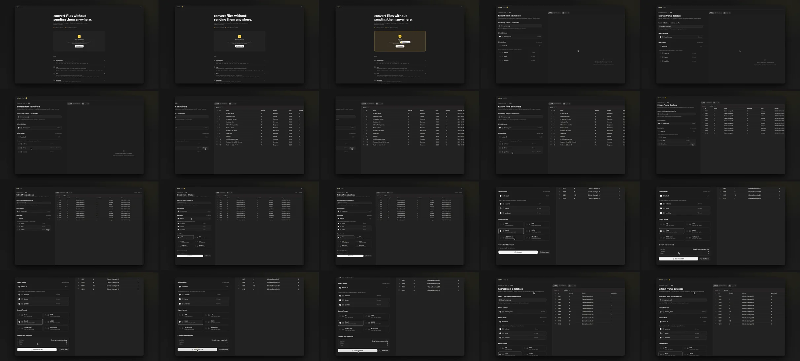

# vídeos de demo que mostram o produto: a skill portfolio-demo

## tl;dr

os estudos de caso do meu portfólio têm um vídeo curto de cada projeto. os primeiros que eu fiz eram **tour pela interface**: pulavam por todas as telas, com cursor vagando, zoom quebrado e tela vazia no meio. escrevi uma skill, a **portfolio-demo**, que faz a IA escolher **um fluxo só**, ensaiar esse fluxo no navegador de verdade, entregar um roteiro com tempo de cada take e, no fim, **revisar o vídeo exportado quadro a quadro**. os vídeos novos têm de 28 a 45 segundos, abrem no que o projeto tem de mais forte e terminam no resultado. a revisão ainda achou um bug no produto, que eu corrigi no projeto em vez de esconder na edição.

## o problema

o vídeo de demo é o atalho do estudo de caso: em 30 segundos o leitor tem que entender o que o projeto faz. os meus antigos falhavam do jeito mais comum:

- **feature dump.** o do cd/ui tinha 72 segundos e mostrava Button, Zod, Dialog e Table sem nenhum fio ligando uma coisa na outra. o do converter-hub pulava pelas 6 ferramentas do app, uma atrás da outra;
- **ilegível.** a página aparecia pequena, com muito espaço vazio e texto minúsculo;
- **cursor sem propósito.** atravessando a tela, rodeando botão, parando em lugar nenhum;
- **estado quebrado na tela.** preview vazio, campo de texto vazio, flash do tema claro no meio de um vídeo escuro.

pedir ajuda pra IA sem regra nenhuma não resolve, só troca o problema: ela quer mostrar tudo, preenche formulário com `test123` e, se deixar, muda o projeto pra ficar bonito na câmera.

## o que a skill faz

a skill é um `SKILL.md` com o processo inteiro. o miolo:

### 1. descobrir antes de gravar

a IA lê README, rotas, dados de exemplo e testes do projeto e responde cinco perguntas: qual problema resolve, pra quem, qual o fluxo principal, qual o recurso mais forte e **o que não mostrar**. não é code review, é entender o produto.

### 2. escolher um fluxo, não um tour

os candidatos são ranqueados por impacto visual, valor de produto, relevância técnica, rapidez e originalidade. no cd/ui foram quatro:

1. busca -> página do componente -> bloco pronto (escolhido: mostra o tamanho medido de cada componente, a instalação em um comando e o preview responsivo, tudo ao vivo);
2. tour pelos componentes (descartado: é feature dump);
3. só os blocos (perde o diferencial do tamanho e da instalação);
4. troca de tema claro/escuro (bonito, mas raso).

no converter-hub, a ferramenta de SQL ganhou: é a mais única do projeto (lê dumps de 24 motores de banco sem executar nada), tem o melhor visual (grade com os dados) e deixa claro que nada sai do navegador. um segundo trecho com CSV ficou de fora de propósito, porque era exatamente o erro do vídeo antigo.

a narrativa é sempre a mesma: **gancho, contexto, fluxo (entrada, ação, transformação, resultado) e prova**. nunca abrir em login, tela vazia ou spinner, e terminar parado no resultado por uns 2 segundos.

### 3. ensaiar no navegador

antes de qualquer gravação, a IA roda o fluxo inteiro no Playwright, no tamanho de janela final, e mede o tempo real de cada passo. no converter-hub o ensaio achou duas coisas:

- com zoom de 100%, o botão **Convert** ficava abaixo da dobra. com 80%, o painel inteiro cabe sem rolar;
- o fluxo inteiro fez **zero requisições** pra fora do domínio do app, o que confirma o "nada é enviado" que o vídeo promete.

### 4. o roteiro (shot list)

a entrega é um markdown com URL exata, tamanho de janela, tema, arquivo de dados, estado inicial e uma tabela de takes: tempo, ação exata, o que quem assiste deve notar e qual edição aplicar (zoom, corte, nada). os dados são fictícios mas realistas: o SQL do converter-hub é de uma livraria inventada, com "Cliente Exemplo 01" e por aí vai.

a regra de segurança é dura: **nunca mexer no produto pela demo**. nada de UI falsa, valor fixo no código ou recurso escondido. se precisar de dado temporário, é por seed ou em runtime, e no fim o `git status` tem que estar limpo.

### 5. revisar o export

depois do export, a IA confere o arquivo com `ffprobe` (duração, 1920x1080, sem áudio) e extrai um quadro a cada poucos segundos pra olhar um por um: UI quebrada, spinner, dado sensível, barra de tarefas vazando, primeiro quadro fraco, último quadro sem sentido.

## o que a revisão pegou

essa parte foi a que mais valeu a pena.

**uma piscada de cor.** no cd/ui, abrir a busca (Ctrl K) escurecia o quadro inteiro de uma vez. a olho nu parecia uma piscada. medi a luminosidade média de cada quadro e achei saltos de 4 a 14 pontos de um quadro pro outro. tirei o trecho que abria e fechava um dialog ao vivo e, onde a luminosidade ainda pulava mais de 4, coloquei um crossfade de 4 quadros (~133 ms). é edição, não interface falsa: a tela continua a mesma.

**um bug no produto.** no preview dos blocos do cd/ui, ao trocar de desktop pra tablet, aparecia **~0,2 s de preview vazio**. não era o vídeo: o iframe só montava no clique e carregava a página inteira do zero. a skill tem uma regra pra isso, "nunca edite em volta de um estado quebrado", então a correção foi no cd/ui: o iframe agora pré-carrega quando o ponteiro ou o foco chega nos botões de dispositivo. capturei de novo e conferi a luminosidade daquela região quadro a quadro: sem nenhum salto.

**detalhe técnico.** a captura por screencast do Edge ignora o `deviceScaleFactor` e devolve pixels CSS. no cd/ui troquei pra um viewport de 1600x900 colocado 1:1 na moldura, sem reescala, e o texto ficou nítido.

**cor igual em todo navegador.** todo vídeo sai em H.264 `yuv420p` com as tags de cor `bt709` completas e `+faststart`. sem as tags, o mesmo arquivo aparece com cor diferente em navegadores diferentes.

## onde o plano mudou

a skill foi escrita com uma divisão clara: **a IA planeja, ensaia e revisa; eu gravo e edito no Recordly**. o roteiro do converter-hub saiu nesse formato, com configuração do Recordly e tudo.

na prática, os três vídeos que estão no portfólio hoje foram **capturados por script**, não gravados à mão:

- **cd/ui e converter-hub:** o Playwright dirige o Edge no site publicado, um cursor desenhado é injetado na página (sem alterar o site), o screencast do navegador vira um vídeo de 30 fps constante e o ffmpeg aplica os zooms, a moldura e o export. no cd/ui, os zooms ficam presos a marcas gravadas durante a captura, então uma variação de rede não desalinha nada;
- **sentinel-forge:** o produto é uma CLI, então a saída **real** da ferramenta é gravada num JSON e reencenada numa página HTML que desenha o terminal quadro a quadro. a única mudança no texto foi trocar um caminho absoluto por `./rules`, e os IPs são de faixas reservadas pra documentação (RFC 5737).

o que não mudou foi o resto da skill: escolher um fluxo, dados fictícios, não mexer no produto e revisar quadro a quadro. foi isso que fez os vídeos ficarem bons, não a ferramenta de gravação.

de bônus, como a captura é script, cada vídeo existe nos **dois temas** com o mesmo roteiro e o mesmo tempo. o portfólio mostra a versão escura ou a clara conforme o tema de quem está lendo.

## o que eu aprendi

- **um fluxo bom vale mais que todas as features.** os vídeos ficaram menores (o do cd/ui foi de 72 para 45 segundos) e explicam mais.
- **ensaiar acha problema antes de gravar.** botão abaixo da dobra, clique no botão errado, tela vazia: tudo apareceu no ensaio, não no vídeo.
- **revisar quadro a quadro é o passo que ninguém faz.** a piscada e o preview vazio passam batido assistindo em velocidade normal.
- **se a demo mostra um bug, o bug é do produto.** corrigir no projeto deixou o vídeo honesto e o cd/ui melhor.
- **não acelerar a ação principal.** o vídeo do cd/ui baixou de 58 para 49 segundos encurtando pausas, sem acelerar nada.

a skill está no meu repositório de skills: [github.com/di0rio/cd-skills](https://github.com/di0rio/cd-skills/tree/main/skills/portfolio-demo). os vídeos estão nos estudos de caso do [cd/ui](https://cauadiorio.vercel.app/projetos/cd-ui), do [converter-hub](https://cauadiorio.vercel.app/projetos/converter-hub) e do [sentinel-forge](https://cauadiorio.vercel.app/projetos/sentinel-forge).
